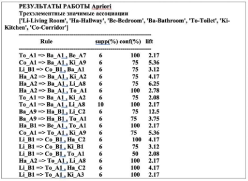
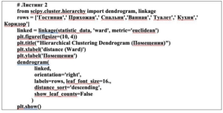
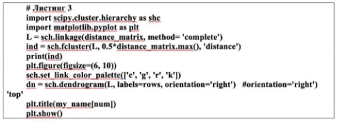
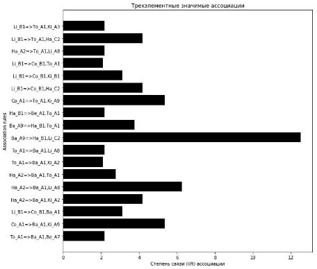

**Мир науки. Педагогика и психология**  2020, №6, Том 8  ISSN 2658-6282 **World of Science. Pedagogy and psychology**  2020, No 6, Vol 8**  [https://mir-nauki.com ](https://mir-nauki.com/)

Мир науки. Педагогика и психология / World of Science. Pedagogy and psychology[ https://mir-nauki.com ](https://mir-nauki.com/)2020, №6, Том 8 / 2020, No 6, Vol 8[ https://mir-nauki.com/issue-6-2020.html ](https://mir-nauki.com/issue-6-2020.html)

URL статьи:[ https://mir-nauki.com/PDF/107PSMN620.pdf ](https://mir-nauki.com/PDF/107PSMN620.pdf)

DOI: 10.15862/107PSMN620 [(http://dx.doi.org/10.15862/107PSMN620)](http://dx.doi.org/10.15862/107PSMN620) 

**Ссылка для цитирования этой статьи:** 

Самойлова Т.А., Грибер Ю.А. Интеллектуальный анализ цветовых предпочтений: поиск ассоциативных правил vs. кластерный анализ // Мир науки. Педагогика и психология, 2020 №6, https://mir-nauki.com/PDF/107PSMN620.pdf (доступ свободный). Загл. с экрана. Яз. рус., англ. DOI: 10.15862/107PSMN620 

**For citation:** 

Samoylova T.A., Griber Yu.A. (2020). Intelligent analysis of color preferences: search for associative rules vs. cluster analysis. *World of Science. Pedagogy and psychology*, [online] 6(8). Available at: https://mir-nauki.com/PDF/107PSMN620.pdf (in Russian) DOI: 10.15862/107PSMN620 

*Исследование  выполнено  при  финансовой  поддержке  РФФИ  в  рамках  научного  проекта  №  17-29-09145 «Картография  цвета:  диагностика  развития  цветонаименований  русского  языка  с  использованием естественно-научных, историографических, социологических и психологических методов»* 

**УДК 159.9.072.533 ГРНТИ 15.01.77** 

**Самойлова Татьяна Аркадьевна** 

ФГБОУ ВО «Смоленский государственный университет», Смоленск, Россия Доцент кафедры «Информатики» 

Кандидат технических наук, доцент E-mail: tatsamoilova24@gmail.com 

РИНЦ:[ https://elibrary.ru/author_profile.asp?id=100995 ](https://elibrary.ru/author_profile.asp?id=100995)

**Грибер Юлия Александровна** 

ФГБОУ ВО «Смоленский государственный университет», Смоленск, Россия Профессор кафедры «Социологии и философии» 

Директор «Лаборатории цвета»[^1] Доктор культурологии 

E-mail: y.griber@gmail.com ORCID:[ https://orcid.org/0000-0002-2603-5928 ](https://orcid.org/0000-0002-2603-5928)

РИНЦ:[ https://www.elibrary.ru/author_profile.asp?id=303167 ](https://www.elibrary.ru/author_profile.asp?id=303167)Researcher ID:[ https://www.researcherid.com/rid/AAG-4410-2019 ](https://www.researcherid.com/rid/AAG-4410-2019)SCOPUS:[ https://www.scopus.com/authid/detail.url?authorId=56809444600 ](https://www.scopus.com/authid/detail.url?authorId=56809444600)

**Интеллектуальный анализ цветовых предпочтений: поиск ассоциативных правил vs. кластерный анализ** 

**Аннотация.**  Цель  статьи  заключается  в  том,  чтобы  представить  опыт экспериментальной реализации на основе современных программных платформ и технологий двух  различных  методов  интеллектуального  анализа  данных  –  (1)  метода  поиска ассоциативных правил в ответах испытуемых и (2) метода кластеризация ответов. Авторы анализирую  возможности  и  ограничения  использования  этих  методов  в социально-психологическом  исследовании  цветовых  предпочтений.  Материалом  для проводимого эксперимента стали данные социально-психологического исследования, в ходе которого  испытуемым  (N = 50)  показывали  цветовую  палитру,  содержащую  27  различных 

**Мир науки. Педагогика и психология**  2020, №6, Том 8  ISSN 2658-6282 **World of Science. Pedagogy and psychology**  2020, No 6, Vol 8**  [https://mir-nauki.com ](https://mir-nauki.com/)

оттенков, и просили выбрать из нее те цвета, которые, по их мнению, лучше всего подходили для интерьера каждого из семи различных типов помещений: гостиной, прихожей, спальни, ванной, туалета, кухни и коридора. Средствами алгоритма Apriori получены ассоциативные правила,  соответствующие  взаимосвязям  между  цветовыми  предпочтениями  и  типами помещений. Рассмотрены особенности применения метода иерархической кластеризации для получения выводов, к которым невозможно прийти, вычисляя лишь процентные показатели. Выполнен  выбор  правил  объединения  кластеров,  дающий  наиболее  объективную  и информативную  оценку  ответов.  Предложено  рассчитывать  расстояние  между  цветовыми выборами респондентов по метрике цветового отличия CIEDE2000. На конкретных примерах показано,  что  оба  метода  интеллектуального  анализа  открывают  широкие  возможности визуализации  выявленных  психологических  механизмов  и  закономерностей.  Проведены эксперименты,  в  ходе  которых  установлено,  что  выбранные  методы  позволяют  проводить эффективную оценку материала социально-психологических исследований. Установлено, что при значительном увеличении числа испытуемых и количества возможных вариантов ответов, задача поиска ассоциаций эффективно решается параллельными методами. 

**Ключевые слова:** методы интеллектуального анализа данных; ассоциативные правила; алгоритм Apriori; кластерный анализ; иерархическая кластеризация; язык Python; цветовые предпочтения 

**Введение** 

Методы  интеллектуального анализа  данных  получают  все  большую  популярность  в социально-психологических исследованиях (см., напр.: [1–3]), что связано с ростом объема обрабатываемой  в  этой  сфере  информации  и  с  тем,  что  из  всего  арсенала  методов интеллектуального анализа подавляющее большинство хорошо подходят для анализа связей между  номинальными  данными,  присущими  психической  жизни  и  социальным  явлениям. Интеллектуальный анализ позволяет не только выявлять статистические закономерности, но и строить  модели,  способные  объяснить  редко  встречающиеся  явления  (см.  напр.:  [4–6]).  В случае нечисловых данных, где привычные статистические пакеты могут применяться лишь ограниченно,  свободно  распространяемые  программные  средства  с  дружественным графическим интерфейсом и богатыми возможностями визуализации полученных результатов, такие как язык Python, показывают себя гораздо эффективнее и в совокупности с библиотеками Pandas, Numpy, Scikit-learn и многими другими предоставляют все необходимые инструменты для интеллектуального анализа. 

Практически  все  предыдущие  исследования  показывают  необходимость дополнительных  вычислительных  экспериментов  для  определения  в  каждом  конкретном случае  оптимального  метода  интеллектуального  анализа,  свободного  от  субъективных предпочтений исследователя (см. напр.: [7; 8]). 

**Цель  статьи**  заключается  в  том,  чтобы  представить  опыт  экспериментальной реализации  на  основе  современных  программных  платформ  и  технологий двух  различных методов  интеллектуального  анализа  данных  –  (1)  метода  поиска  ассоциативных  правил  в ответах  испытуемых  и  (2)  метода  кластеризация  ответов  –  и  сравнить  возможности  и ограничения  использования  этих  методов  в  социально-психологическом  исследовании цветовых предпочтений. 

**Мир науки. Педагогика и психология**  2020, №6, Том 8  ISSN 2658-6282 **World of Science. Pedagogy and psychology**  2020, No 6, Vol 8**  [https://mir-nauki.com ](https://mir-nauki.com/)

**Методы** 

1) **Методы поиска ассоциативных правил** 

Методы  поиска  ассоциаций  все  чаще  используются  в  современных социально-психологических исследованиях для обнаружения скрытых зависимостей между признаками:  например,  для  выявления  связи  между  страной  проживания  и  устоявшимися стереотипами  [9],  закономерностями  потребительского  поведения  [1],  стилем  активности личности [2]. 

Каждое  ассоциативное  правило  характеризуется  определенными  параметрами. Параметр,  называемый  поддержкой  (support),  показывает  частоту  встречаемости  данного правила  в  имеющемся  множестве  транзакций.  Поддержка  правила  *X* Þ *Y*  вычисляется  как процент транзакций, содержащий множество *X* Ս *Y*:supp(*X* Þ *Y*) = (N(*X* Ս *Y*) / |D|) × 100 %, где N(*X* Ս Y) – количество транзакций, содержащих множество *X* Ս *Y*. 

Достоверность ассоциативного правила (confidence) показывает, с какой вероятностью из  *X*  следует  *Y*.  Вычисляется  достоверность  правила  *X* Þ *Y*  как  процент  транзакций, содержащих  как  *X*,  так  и  *Y*  в  базе  транзакций,  содержащих *X*: conf(*X* Þ *Y*) = supp(*X* Þ *Y*) / supp(*X*). 

Лифт  (lift)  –  показатель,  позволяющий  оценить  значимость  правила.  Он  связывает поддержку и достоверность и определяется по формуле: lift(X Þ Y) = conf(*X* Þ *Y*) / supp(*Y*). Лифт характеризует меру связи ассоциации: если лифт меньше 1 – связь отрицательная, равно 1 – отсутствует, больше 1 – связь положительная и чем больше, тем сильнее. 

Поиск  ассоциативных  правил  состоит  в  определении  импликаций  наборов  ответов респондентов,  поддержка  которых  не  ниже,  чем  minsupport.  Затем  из  найденных  наборов выделяются правила с достоверностью не ниже minconfidence и лифтом не ниже minlift. Выбор алгоритма  поиска  ассоциативных  правил  определяется,  прежде  всего,  объемом  входных данных и числом возможных вариантов ответов. 

2) **Метод кластеризации** 

Объектами  для  применения  метода  кластеризации  в  современных  социально- психологических исследованиях являются числовые или номинальные признаки, корреляции, результаты  статистической  обработки  и  т. д.  (см.  напр.:  [3;  6;  7]).  Этот  метод  обычно используется для выявления структуры данных и определения нетипичных объектов. 

Задача кластеризации результатов исследования заключается в том, чтобы так разбить выборку,  представляющую  собой  ответы  респондентов  в  виде  строковых  констант  или числовые результаты статистической обработки по категориям ответов, на непересекающиеся подмножества – кластеры, чтобы каждый кластер состоял из наиболее похожих объектов, которые, в то же время, будут значительно отличаться от объектов остальных групп. 

Известны  несколько  подходов  к  решению  задачи  кластеризации:  нейросетевой, статистический,  теоретико-графовый,  иерархический.  При  обработке  данных,  имеющих небольшой  объем,  наиболее эффективным  считается  метод  иерархической агломеративной кластеризации  [8].  Его  характеризует  содержательная  ясность  и  относительная  простота алгоритмов, допустимость контролируемого вмешательства в работу алгоритма, возможность визуализации данных в виде дерева (дендрограммы). В общем виде алгоритм иерархической агломеративной кластеризации включает создание первичного набор кластеров Y, каждый из которых содержит один элемент набора кластеризации X; расчет матрицы сходства между кластерами; определение наиболее близких по метрике сходства кластеров и их объединение по определенному правилу. 

Страница 4** из 14** 

107PSMN620

Издательство «Мир науки» \ Publishing company «World of science[» http://izd-mn.com](http://izd-mn.com/)
**Мир науки. Педагогика и психология**  2020, №6, Том 5  ISSN 2658-6282 

**World of Science. Pedagogy and psychology**  2020, No 6, Vol 8**  [https://mir-nauki.com ](https://mir-nauki.com/)

3) **Материал исследования** 

Материалом для проводимого эксперимента стали данные социально-психологического исследования,  в  ходе  которого  испытуемым  (N = 50)  показывали  цветовую  палитру, содержащую  27  различных  оттенков,  и  просили  выбрать  из  нее  те  цвета,  которые,  по  их мнению, лучше всего подходили для интерьера каждого из семи различных типов помещений: гостиной, прихожей, спальни, ванной, туалета, кухни и коридора. Ответы непосредственно задавались цветовым кодом из множества А1¸А9, В1¸В9, С1¸С9 (см. подробнее: [10]). 

Таким образом, имеющаяся база данных состояла из 50 транзакций, каждая из которых представляла  собой  набор  ответов  одного  респондента.  Ответы  были  представлены строковыми константами, позволяющими находить повторяющиеся наборы ответов в разных транзакциях (табл. 1). 

**Таблица 1**  

**Фрагмент данных из нескольких транзакций** 

|**№** |Гостиная |Прихожая |Спальня |Ванная |Туалет |Кухня |Коридор |
| - | - | - | - | - | - | - | - |
|**1** |A5 |A5 |A4 |C3 |C3 |B5 |B1 |
|**2** |B1 |B1 |B1 |A5 |A5 |B1 |B1 |
|**3** |A8 |B2 |A2 |A1 |A1 |A6 |B5 |
|**4** |B6 |B3 |B9 |A8 |A1 |A5 |B1 |
|**…** |... |... |... |... |... |... |... |
|**49** |B5 |B9 |B6 |B8 |A1 |A9 |B7 |
|**50** |A3 |B2 |B9 |B2 |A1 |A2 |B2 |
*Составлено авторами на основе полученных в ходе эксперимента ответов респондентов*** 

**Результаты и обсуждение** 

1) **Поиск ассоциативных правил в цветовых предпочтениях респондентов** 

Поскольку в проведенном опросе участвовало небольшое число испытуемых, несмотря на существенное число вариантов (27 выбираемых цветов х 7 видов помещений = 189) ответов, наиболее эффективным для решения поставленных в исследовании задач оказался алгоритм Аpriori,  который  предназначен  для  поиска  всех  частых  множеств  признаков  и  является поуровневым, поскольку использует стратегию поиска «в ширину» и осуществляет его снизу- вверх [11]. 

Обработка данных опроса алгоритмом Аpriori включала три этапа. 

1. *Объединение* – просмотр всей базы данных транзакций и определение частоты вхождения  отдельных  ответов  респондентов  по  каждому  из  помещений (одноэлементные наборы). 
1. *Сокращение* – перевод наборов ответов, которые удовлетворяют поддержке и достоверности (кандидаты), в следующий раунд (двухэлементные наборы). 
1. *Повторение* предыдущих двух этапов для каждой величины набора до тех пор, пока не будет повторно получен ранее определенный размер. 

Результат  работы  алгоритма  –  объединение  всех  множеств  k-элементных  наборов ответов *X* для k = 1, 2, ..., n, где n – максимальное число элементов в наборе ответов (рис. 1). 

Применение  алгоритма  позволяет  обнаружить  значимые  двух-,  трех-  и четырехэлементные ассоциации цветов семи видов помещений (рис. 2). Значения параметров support, confidence и lift определяется оператором вызова алгоритма Apriori. 

Страница 5** из 14** 

107PSMN620

Издательство «Мир науки» \ Publishing company «World of science[» http://izd-mn.com](http://izd-mn.com/)

**Мир науки. Педагогика и психология**  2020, №6, Том 8  ISSN 2658-6282 **World of Science. Pedagogy and psychology**  2020, No 6, Vol 8**  [https://mir-nauki.com ](https://mir-nauki.com/)

***Рисунок 1.** Фрагмент листинга Python-программы, реализующей                  алгоритм Apriori (пакет «Apriori 1.1.1» из центрального репозитария модулей языка Python – Python Package Index). Автор: Самойлова Т.А.*** 

К примеру, значение supp (Гостиная A8 Þ Прихожая B2, Коридор B5) = 0.1 означает, что 10 % из общего числа всех транзакций содержат одновременный выбор трех указанных цветов  для  гостиной,  прихожей  и  коридора.  Достоверность conf(Прихожая B9 Þ Ванная A1, Кухня C5) = 0.6 означает, что 60 % транзакций, содержащих выбранный прихожей цвет B9, содержат выбранный для ванной цвет A1 и выбранный для кухни цвет C5. Значение lift(Гостиная B5 ÞПрихожая B9) = 5.8 говорит о достаточно сильной связи  между  указанным  выбором.  Полученное  в  результате  ассоциативное  правило «Гостиная A8 Þ Прихожая B2» означает следующее: если для гостиной респондент выбрал цвет A8, то для прихожей он выберет цвет B2. 

***Рисунок 2.** Фрагмент результатов выполнения программы поиска* 

*значимых цветовых ассоциаций для трех помещений и следующих значений параметров: minsupport = 0,4; minconfidence = 0,5; minlift = 2,0. Автор: Самойлова Т.А.*** 

2) **Кластеризация цветовых предпочтений респондентов** 

Проведенная  экспериментальная  реализация  показала,  что  для  обработки  цветовых предпочтений  испытуемых  хорошо  подходят  разные  варианты  алгоритма  кластеризации, отличающиеся  расчетом  метрики  сходства  и  правилами  объединения  кластеров.  В  случае 

Страница 7** из 14** 

107PSMN620

Издательство «Мир науки» \ Publishing company «World of science[» http://izd-mn.com](http://izd-mn.com/)

**Мир науки. Педагогика и психология**  2020, №6, Том 8  ISSN 2658-6282 **World of Science. Pedagogy and psychology**  2020, No 6, Vol 8**  [https://mir-nauki.com ](https://mir-nauki.com/)

числовых значений кластеризуемых данных, меры сходства могут вычисляться стандартным способом  по  расстоянию  Евклида.  Для  нечисловых  данных,  заданных  цветовой  палитрой, метрики  сходства  могут  рассчитываться  по  методике,  соответствующей  международной стандартной цветовой модели CIELAB, в которую переводятся цвета, указанные в ответах респондентов. При этом хорошие результаты показывает расчет меры сходства по формуле цветового отличия CIEDE2000 [12], которая позволяет математически представить расстояние между двумя оттенками в цветовом пространстве. 

В  ходе  программного  эксперимента  было  исследовано  влияние  на  результаты кластеризации  правил  объединения  кластеров:  'average'  –  попарного  среднего,  'single'  – ближайшего  соседа,  'complete'  –  дальнего  соседа,  'ward'  –  Уорда.  Экспериментальная реализация  показала,  что  в  случае  числовых  исходных  данных  количество  кластеров практически не зависело от выбранного правила и поэтому вычисления проводились методом Уорда [8], который стремится создавать кластеры равных размеров. В частности, наилучший результат  показало  применение  метода  Уорда  к  результатам  статистической  обработки результатов  исследования,  представленных  распределением  оценок  (%)  выбора  цвета респондентами по каждому из помещений (рис. 3). 

***Рисунок 3.** Фрагмент листинга Python-программы кластеризации методом Уорда. Автор: Самойлова Т.А.* 

В  методе  Уорда  для  оценки  степени  сходства  кластеров  берется  каждая  их  пара  и рассчитывается, насколько увеличится дисперсия, если их объединить. Эта целевая функция известна как внутригрупповая сумма квадратов отклонений (СКО): 

СКО = (Xi)2 − 1/(n ∗ (∑Xi)2, где Xi – значение признака i-го объекта. 

Если кластеры находятся очень далеко друг от друга, то при их объединении дисперсия также  окажется  очень  большой.  Избежать  этого  можно,  лишь  объединяя  очень  близко находящиеся друг к другу кластеры, для которых целевая функция СКО получает минимальное приращение. 

В  случае  данных,  задаваемых  цветовой  палитрой,  число  кластеров  существенно зависело от выбора правила их объединения и варьировалось в диапазоне от 3 до 10. Наиболее оптимальным оказался результат, полученный для правила «дальнего соседа», когда степень сходства  оценивается  по  степени  сходства  между  наиболее  отдаленными  (несхожими) объектами  кластеров  (рис.  4).  Согласно  этому  правилу,  расстояние  между  кластерами определяется  как  максимальное  расстояние  между  всеми  возможными  точками  в  двух кластерах. 

**Мир науки. Педагогика и психология**  2020, №6, Том 8  ISSN 2658-6282 **World of Science. Pedagogy and psychology**  2020, No 6, Vol 8**  [https://mir-nauki.com ](https://mir-nauki.com/)

***Рисунок 4.** Фрагмент листинга Python – программы, разработанной* 

*для проведения кластеризации методом «дальнего соседа». Автор: Самойлова Т.А.* 

При  программной  реализации  средствами  Python-пакета  Hierarchical  clustering  из библиотеки SciPy в пакете имеется возможность вмешательства в работу алгоритма путем включения  нестандартного  блока  расчета  расстояний  между  ответами  респондентов  по формуле цветового отличия CIEDE2000 [12]. Он позволяет также выполнять кластеризацию средствами метода linkage, где есть возможность задания конкретного правила объединения кластеров. 

3) **Визуализация результатов интеллектуального поиска** 

Оба метода интеллектуального анализа открывают широкие возможности визуализации выявленных психологических механизмов и закономерностей. 

Значения  параметра  lift-значимости  трехэлементных  ассоциаций,  найденных алгоритмом Аpriori могут быть представлены в форме диаграммы (рис. 5). 

***Рисунок 5.** Диаграмма значимости (lift) трехэлементных                ассоциаций цветовых предпочтений респондентов. Автор: Самойлова Т.А.* 

**Мир науки. Педагогика и психология**  2020, №6, Том 8  ISSN 2658-6282 **World of Science. Pedagogy and psychology**  2020, No 6, Vol 8**  [https://mir-nauki.com ](https://mir-nauki.com/)

Применение метода кластеризации позволяет средствами языка Python 3.6 формировать дендрограммы  с  использованием  базовой  функции  shc.dendrogram  (рис.  6).  Программа позволяет разрезать дерево дендрограммы на группы кластеров, которые изображаются в виде прямоугольников. Мера сходства ответов выполняется по стандарту CIEDE2000 посредством вычисления матрицы расстояний, непосредственно используемой алгоритмом кластеризации, или по метрике Евклида. 

***Рисунок 6.** Дендрограмма кластеризации цветовых предпочтений респондентов. Автор: Самойлова Т.А.* 

Кроме того, визуализация результатов в обоих случаях может выполняться средствами специализированного  Python-пакета  «Tkinter»  и  в  случае  применения  метода  поиска ассоциаций может показывать наиболее заметные связи между цветами и типами помещений (рис.  7),  а  при  применении  различных  алгоритмов  кластеризации  –  пояснять  данные дендрограмм (рис. 8). 

  

***Рисунок 7.** Визуализация значимых ассоциаций цветовых               предпочтений респондентов в цветовой палитре. Автор: Самойлова Т.А.* 

***Рисунок 8.** Результаты кластеризации ответов в цветовой палитре. Автор: Самойлова Т.А.* **Мир науки. Педагогика и психология**  2020, №6, Том 8  ISSN 2658-6282 **World of Science. Pedagogy and psychology**  2020, No 6, Vol 8**  [https://mir-nauki.com ](https://mir-nauki.com/)

**Выводы** 

В целом проведенные исследования показывают, что оба метода интеллектуального анализа данных (метод поиск ассоциативных правил и метод иерархической кластеризации), хорошо подходят для обработки данных социально-психологических исследований цветовых предпочтений. 

Метод  поиска  ассоциаций  позволяет,  установив  минимальные  значения  параметров таким  образом,  чтобы  ограничить  количество  найденных  правил,  выявить  новые психологические механизмы и закономерности в ответах респондентов, а также проверить зависимость выбираемых цветов от типов объектов и социальных характеристик участников (их пола, возраста, места проживания). 

При значительном увеличении числа участников исследования и количества возможных вариантов ответов, задача поиска ассоциаций эффективно решается параллельными методами.** 

Предложенный  подход  к  кластеризации,  основанный  на  вычислении  меры  сходства ответов  респондентов  по  формуле  цветового  отличия  CIEDE2000  и  допускающий  выбор правила объединения кластеров, позволяет сделать выводы, к которым невозможно прийти, вычисляя лишь процентные показатели. При этом в зависимости от целей исследования, в качестве правил объединения кластеров могут выбираться различные методы, отличающиеся решением вопроса о схожести объектов при их объединении в группу: метод дальнего соседа, одиночной связи, попарного среднего, Уорда. 

**ЛИТЕРАТУРА** 

1. Chong A.Y.L., Ch’ng E., Liu M.J., and Li B. Predicting consumer product demands via big data: the roles of online promotional marketing and online reviews // International Journal  of  Production  Research.  2017.  №  55  (17).  P.  5142–5156. https://doi.org/10.1080/00207543.2015.1066519. 
1. Fazzolari M., Petrocchi M. A study on online travel reviews through intelligent data analysis  //  Information  Technology  and  Tourism.  2018.  №  20.  P.  37–58. https://doi.org/10.1007/s40558-018-0121-z. 
1. Бродовская Е.В., Домбровская А.Ю., Иванов И.С. Изменение стратегий онлайн- поведения  российской  интернет-аудитории:  результаты  сравнительного кластерного  анализа  (2012–2014  гг.)  //  Мониторинг  общественного  мнения: Экономические  и  социальные  перемены.  2016.  №  3.  С.  173–187. https://doi.org/10.14515/monitoring.2016.3.10. 
1. Kyslova O. Big Data in the Context of Studying Problems of Modern Society // Visnyk V.N.  Karazin  Kharkiv  National  University.  Series  «Sociological  Studies  of Contemporary  Society:  Methodology,  Theory,  Methods».  2020.  №  43.  P.  26–33. https://doi.org/10.26565/2227-6521-2019-43-03. 
1. Jonauskaite  D.,  Abu-Akel  A.,  Dael  N. et  al.  Universal  Patterns  in  Color-Emotion Associations  are  Further  Shaped  by  Linguistic  and  Geographic  Proximity  // Psychological  Science.  2020.  №  31(10).  Р.  1245–1260. https://doi.org/10.1177/0956797620948810. 
1. Uusküla  M.,  Bimler  D.L.  From  listing  data  to  semantic  maps:  Cross‐linguistic commonalities in cognitive representation of color // Folklore. 2016. № 64. P. 159–180. https://doi.org/10.7592/FEJF2016.64.colour. 

**Мир науки. Педагогика и психология**  2020, №6, Том 8  ISSN 2658-6282 **World of Science. Pedagogy and psychology**  2020, No 6, Vol 8**  [https://mir-nauki.com ](https://mir-nauki.com/)

7. Беликова  М.Ю.,  Каранина  С.Ю.,  Глебова  А.В.  Экспериментальное  сравнение алгоритмов кластеризации в задаче группировки данных о грозовых разрядах // Кибернетика  и  программирование.  2018.  №  1.  С.  15–26. https://doi.org/10.25136/2306-4196.2018.1.25261. 
7. Xu D., Tian Y. A Comprehensive Survey of Clustering Algorithms // Annals of Data Science. 2015. № 2. P. 165–193. https://doi.org/10.1007/s40745-015-0040-1. 
7. Schnaudt Ch., Weinhardt M., Fitzgerald R., and Liebig St. The European Social Survey: Contents, Design, and Research Potential // Schmollers Jahrbuch. 2014. № 134 (4). P. 487–506. https://doi.org/10.3790/schm.134.4.487. 
7. Грибер Ю.А., Самойлова Т.А., Двойнев В.В. Цветовые предпочтения пожилых людей в различных типах жилого интерьера // Урбанистика. 2018. № 4. С. 36–49. https://doi.org/10.7256/2310-8673.2018.4.28349. 
7. Tank D. Improved Apriori Algorithm for Mining Association Rules // International Journal of Information Technology and Computer Science. 2014. № 6 (7). Р. 15–23. https://doi.org/10.5815/ijitcs.2014.07.03. 
7. Luo M.R., Cui G. and Rigg B. The Development of the CIE 2000 Colour Difference Formula: CIEDE2000 // Color Research & Application. 2001. № 26 (5). P. 340–350. https://doi.org/10.1002/col.1049. 

**Мир науки. Педагогика и психология**  2020, №6, Том 8  ISSN 2658-6282 **World of Science. Pedagogy and psychology**  2020, No 6, Vol 8**  [https://mir-nauki.com ](https://mir-nauki.com/)

**Samoylova Tatyana Arkadyevna** 

Smolensk state university, Smolensk, Russia E-mail: tatsamoilova24@gmail.com 

РИНЦ:[ https://elibrary.ru/author_profile.asp?id=100995 ](https://elibrary.ru/author_profile.asp?id=100995)

**Griber Yulia Alexandrovna** 

Smolensk state university, Smolensk, Russia E-mail: y.griber@gmail.com 

ORCID:[ https://orcid.org/0000-0002-2603-5928 ](https://orcid.org/0000-0002-2603-5928)РИНЦ:[ https://www.elibrary.ru/author_profile.asp?id=303167 ](https://www.elibrary.ru/author_profile.asp?id=303167)

Researcher ID:[ https://www.researcherid.com/rid/AAG-4410-2019 ](https://www.researcherid.com/rid/AAG-4410-2019)SCOPUS:[ https://www.scopus.com/authid/detail.url?authorId=56809444600 ](https://www.scopus.com/authid/detail.url?authorId=56809444600)

**Intelligent analysis of color preferences:      search for associative rules vs. cluster analysis** 

**Abstract.** The aim of the article is to present the experience of experimental implementation on the basis of modern software platforms and technologies of two different methods of data mining: (1) the method of associative rules, and (2) the method of clustering. The authors analyze potential and limitations of using both methods in socio-psychological research of color preferences. The material for the conducted experiment was the data of a socio-psychological study in the course of which the subjects (N = 50) were shown a color palette containing 27 different shades and were asked to select from it the colors which, in their opinion, best fit the interior of each of seven different room types: living room, entrance room, bedroom, bathroom, toilet, kitchen, and hallway. By means of the Apriori algorithm we obtained associative rules corresponding to the relationship between color preferences and room types. We discuss the potential of hierarchical clustering method application for obtaining conclusions, which cannot be achieved by calculating percentages. The choice of rules for combining clusters, which give the most objective and informative assessment of responses, is performed. It was proposed to calculate the distance between color choices of respondents using CIEDE2000 color difference metric. By means of concrete examples it is shown that both methods of intellectual analysis open wide possibilities for visualization of the revealed psychological mechanisms and regularities. Experiments were carried out, in the course of which it was established that the chosen methods allow to carry out an effective assessment of social and psychological research data. We can conclude that with a significant increase in the number of respondents and the range of possible variants of answers, the task of finding associations is effectively solved by parallel methods. 

**Keywords:** data mining techniques; associative rules; Apriori algorithm; cluster analysis; hierarchical clustering; Python language; color preferences 
Страница 14** из 14** 

107PSMN620

Издательство «Мир науки» \ Publishing company «World of science[» http://izd-mn.com](http://izd-mn.com/)

[^1]: Сайт лаборатории: color-lab.org 