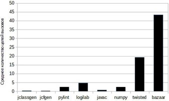
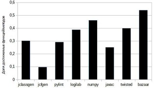
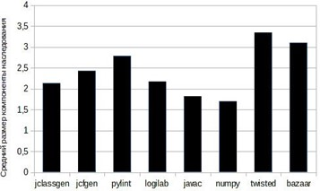
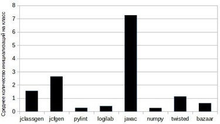
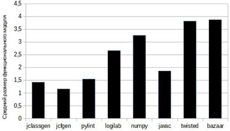
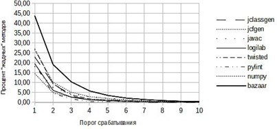
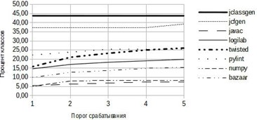

Для выполнения статического анализа предложено использовать универсальные многоуровневые промежуточные представления. Для анализа архитектуры проекта разработано представление уровня классов, а для анализа функциональных модулей – потока управления. Было реализовано их получение. Для решения задач извлечения информации из исходного текста и предложения рефакторинга был составлен список анализов, основывающихся на подходе совместного использования нескольких представлений. Для реализации анализов были составлены математические модели, формализующие их работу. Часть моделей позволяет рассчитать метрики анализируемого кода, которые могут дать дополнительную информацию о проекте. Для двух анализов были предложены модели на основе пороговых функций, а также модели для вычисления самих порогов. Выбранные анализы были реализованы на основе предложенных моделей в виде утилит-анализаторов. В качестве основы для тестирования и практической проверки анализаторов выступили крупные open-source проекты и собственный код. Так как представления и полученные анализаторы – универсальные, то использовались проекты на языках Java и Python. По каждому проекту были посчитаны величины метрик, что позволило получить информацию о среднем размере компоненты наследования и о зависимости функциональной компоненты. Ряд метрик наглядно показал различия в подходах к программированию в языках Java и Python. Для анализов, использующих пороговые функции, были смоделированы и рассчитаны оптимальные значения порога для выбранных проектов. Эти значения подходят в качестве исходных для анализа других. Реализованные анализаторы, помимо практической ценности, демонстрируют также возможность и эффективность использования промежуточных представлений, предложенных ранее.

**Ключевые слова:** статический анализ, промежуточное представление, численное моделирование, рефакторинг, граф потока управления.

## Введение

Статический анализ исходного кода служит для автоматизации задач разработки программного обеспечения. Он позволяет выполнять поиск ошибок, улучшать качество кода, делать подсказки по рефакторингу, извлекать информацию из исходного кода. Достоинства применения универсальных промежуточных представлений при статическом анализе исходного кода были освещены в [1]. В качестве универсальных промежуточных представлений выступили 2 разработанных представления – универсальное классовое представление UCR и универсальное представление потока управления UCFR. Был разработан список анализов, которые могут быть выполнены с использованием этих универсальных промежуточных представлений. Список включает анализы разной сложности. Реализация некоторых требовала совместного использования обоих представлений, других – только одного из представлений. В качестве основы для практической проверки реализации анализов использовались крупные open-source-проекты, а также собственный код.

## Постановка задачи

Для решения задач извлечения информации из исходного кода, анализа архитектуры проекта, анализа потока управления и проведения рефакторинга в [1] было предложено использовать универсальные многоуровневые промежуточные представления, формируемые при статическом анализе. Был составлен список анализов, использующих следующие представления: UCR – классовое, UCFR – потока управления. Назначение такого списка – указание возможных направлений применения универсальных промежуточных представлений в статическом анализе исходя из поставленных задач.

Для реализации анализов из списка необходимо формализовать каждый анализ в виде математической модели. Эта модель позволит однозначно описать требования к конкретному анализу. Важную информацию об исследуемом проекте могут показывать его метрики, которые позволяют оценить его структуру и сделать выводы. На основе моделей анализов можно вычислить ряд таких метрик.

## Список реализованных анализов

Среди анализов можно выделить следующие группы:

- анализы, предлагающие улучшение кода;
- анализы, вычисляющие метрики исходного кода;
- анализы с помощью визуальных диаграмм.

В качестве вспомогательных задач были реализованы генераторы «срезов» промежуточных представлений. Под срезом понимается часть представления, выбранная по особому критерию. Важной особенностью является то, что срез представления является сам по себе валидным представлением.

Из общего списка были формализованы модели анализов и реализованы на практике перечисленные ниже. Каждый анализ имеет свой идентификатор, по которому он вызывается. Для удобства они приведены в скобках. В дальнейшем будем указывать эти идентификаторы для отсылки к тому или иному анализу.

Анализы с вычислением метрик:

1. Построение срезов представления потока управления (FlatUCFRSlicer), метрика сложности связей между функциональными блоками.
2. Анализ недостижимых функциональных блоков (UnreachableCodeSearch), метрика доли достижимых функциональных модулей в проекте.
3. Построение срезов классового представления по наследованию (InheritanceSlicer), метрика, характеризующая сложность иерархии наследования проекта.
4. Построение срезов классового представления по критерию представления потока данных (InstanceInitSlicer), метрика количества создания одних классов другими.
5. Поиск трассы между заданными функциональными блоками (ExecRouteSearch), метрика количества независимых функциональных модулей.

Анализы, предлагающие улучшение кода (основаны на использовании пороговых функций):

1. Контроль «жадных» методов, для которых необходимо выполнить рефакторинг [2]
(GreedyFunctionsAnalyzer). «Жадными» считаются те методы, которые обращаются к данным
другого объекта чаще, чем к собственным данным.
2. Контроль положения создаваемых объектов (ObjectCreationAnalyzer). Проверяются
внешние условия с целью определить, в правильном ли месте создаются объекты класса.

## Математические модели анализов и расчет метрик

1. *Построение срезов представления потока управления*. Обозначим множество всех идентификаторов методов и функций проекта как $UCFR{\_}ID$.

Определим отношение $Calls \subseteq UCFR{\_}ID\times UCFR{\_}ID$, куда входят все пары идентификаторов функций/методов проекта, между которыми происходят вызовы.  
$$Calls=(f1,f2)|f1 \ вызывает \ f2,f1\in UCFR{\_}ID,f2\in UCFR{\_}ID\}.$$
&nbsp;

Теперь можно ввести метрику, характеризующую среднее количество вызовов функций/методов проекта для функции/метода проекта. Она рассчитывается как частное от деления мощностей множеств $Calls$ и $UCFR{\_}ID$:  
$$inner=\frac{|Calls|}{|UCFR{\_}ID|}.$$
&nbsp;

Данная метрика позволит оценить меру сцепления (количественную характеристику связей) между функциями/методами проекта. Большие значения данной метрики характерны для проектов с более сложными связями, в которых больше зависимостей между функциями.

2. *Анализ недостижимых функциональных блоков*. Особый интерес представляет область значения отношения $Calls$ – ведь данное множество фактически является множеством достижимых функциональных блоков (функций/методов) проекта. Используя количество уникальных целей вызовов, можно оценить долю достижимых функциональных блоков в проекте. Такая метрика рассчитывается как отношение мощности области значений бинарного отношения $Calls$ – $Im(Calls)$ и мощности множества $UCFR{\_}ID$ [3]. Область значений учитывает только цели вызовов, что не повлияет на вычисление метрики при наличии рекурсии, как прямой и косвенной.

&nbsp;
$$reachable=\frac{|Im(Calls)|}{|UCFR{\_}IDS|}.$$
&nbsp;

Чем меньше значение данной метрики, тем меньше функциональных блоков в проекте недостижимо. Максимальное значение (max(reachable) = 1) соответствует случаю отсутствия в проекте таких блоков, минимальное значение (min(reachable) = 0) может быть достигнуто, когда все функциональные блоки недостижимы друг из друга.

3. *Построение срезов классового представления*. Обозначим множество уникальных идентификаторов классов как $UCR{\_}ID$. Определим отношение наследования $InheritanceEdges\subseteq UCR{\_}ID \times UCR{\_}ID$, включающее все пары классов и их прямых классов-родителей:

&nbsp;
$$InheritanceEdges=(c_1,c_2)|c_2 -родитель \ класса \ c_1, c_1 \in UCR{\_}ID,c_2\in UCR{\_}ID\}.$$
&nbsp;

Таким образом, иерархию наследования классов можно представить в виде графа $G_{inheritance}$, где множество узлов совпадает с множеством уникальных идентификаторов классов, а множество ребер представляет собой отношение $InheritanceEdges$:  
$$InheritanceNodes\equiv UCR{\_}ID.$$
&nbsp;
$$G_{inheritance} = (InheritanceNodes,InheritanceEdges),(1)$$  
$G_{inheritance}$ – граф наследования

Тогда в качестве характеристики иерархии наследования проекта можно взять средний размер компоненты слабой связности графа (1) [4]. Очевидно, каждая компонента слабой связности представляет отдельную иерархию наследования проекта. Будем называть данную компоненту компонентой наследования. Данная метрика позволит оценить сложность объектно-ориентированной иерархии проекта. Большие значения данной метрики характерны для проектов, в которых в единую иерархию наследования объединяется больше классов.

4. *Построение срезов классового представления*. Множество идентификаторов классов проекта обозначено как $UCFR{\_}ID$. Обозначим как $Inits$ множество пар классов, в которых в методах первого создаются объекты второго:

&nbsp;
$$Inits=\left\{(c_1,c_2)|\ в \ методах \ c_1 \ создается \ экземпляр \ класса \ c_2,
c_1 \in UCR{\_}ID,c_2\in UCR{\_}ID \right\}.$$
&nbsp;

С помощью множества $Inits$ (2) можно оценить среднее количество классов, экземпляры которых инициализируются экземплярами класса проекта. Такая метрика рассчитывается как отношение мощностей множеств $Inist$ к $UCFR{\_}ID$:

&nbsp;
$$instances = \frac{|Inits|}{|UCFR{\_}ID|}.$$
&nbsp;

Эта метрика может помочь при контроле создания объектов в проекте. Большие значения метрики характерны для проектов, в которых в среднем происходит больше инициализаций объектов в функциях/методах, в таких проектах выше количество повторно используемого кода.

5. *Поиск трассы между заданными функциональными блоками*. Для решения задачи поиска трассы между двумя заданными   функциями/методами   проект   можно   представить в виде ориентированного графа $G_{calls}$. Вершинам будут соответствовать уникальные идентификаторы из $UCFR{\_}ID$, а ребрам – вызовы между функциями/методами, которые могут быть извлечены из представления $UCFR$.

При таком представлении задача поиска трассы между заданными блоками кода (функция/метод) сводится к поиску пути на графе между заданными узлами. Множество узлов совпадает с множеством уникальных идентификаторов методов функций:

&nbsp;
$$ExecNodes\equiv UCFR{\_}ID.$$
&nbsp;

Множество ребер совпадает с множеством вызовов, представляя пары идентификаторов функций/методов, между которыми есть вызовы:

&nbsp;
$$ExecEdges\equiv Calls.$$
&nbsp;
$$G_{calls} = (ExecNodes,ExecEdges), (3)$$  
$G_{calls}$ – граф вызовов.

Тогда, с использованием среднего размера компоненты слабой связности для графа, моделируемого формулой (3), можно оценить сложность проекта. Это будет ориентированный граф общего вида, допускающий циклы в случае наличия рекурсии. Каждую компоненту слабой связности можно представить в виде некоторой независимой функциональной сущности, и чем больше ее размер, тем сложнее сама сущность. Будем называть данную компоненту функциональной компонентой. Большие значения этой величины соответствуют проектам с более сложной структурой связей вызовов между функциональными блоками.

## Математические модели анализов с пороговыми функциями

1. *Контроль «жадных» методов*.

Согласно принципам рефакторинга [2], от функций, которые часто обращаются к полям и методам объекта другого класса, нужно избавляться путем переноса их в другой класс. Необходимо задать некоторую количественную характеристику, значение которой можно бы было сравнивать с некоторым порогом. Данный вид анализа будет предлагать программисту обратить внимание на некоторые методы, которые он счел «жадными», и принять решение о необходимости рефакторинга.

Пусть $M$ – множество всех методов в исследуемом проекте. Каждый метод внутри себя имеет некоторый поток управления, описываемый в виде блоков и переходов. $F$ – множество всех возможных элементов потока управления (блоки, переходы и ветвления). Тогда множество всех элементов потока управления конкретного метода $m\in M$

&nbsp;
$$F_m =\left\{f|f\in F \right\}.$$
&nbsp;

Пусть $G\subset F$ – множество элементов потока управления, являющихся вызовами к методу некоторого имени через точку (типа getattr). Например, foo.getValue(), но не просто getValue(). Это такие вызовы методов, которые вызываются для какого-то объекта, не являющегося объектом этого класса, например для переменной, поля или параметра. Тогда множество всех getattr-вызовов внутри потока управления метода $m\in M$

&nbsp;
$$G_m =\left\{g|g\in G \right\}.$$
&nbsp;

Будем считать, что $g_i$ соответствует $g_j\ ; \ g_i,g_j \in G_m$ , если $g_i$ и $g_j$ ссылаются на одно и тоже имя. Этим именем может быть переменная, поле или параметр метода. Тогда множество вызовов, обращенных к одному имени,

&nbsp;
$$G_n = \left\{g|g\in G_m,g_i \ соответсвтует \ g_j \forall g_i,g_j \in G_n \right\},$$
&nbsp;

где $G_n\subset G_m$. Мощность этого множества будет показывать количество вызовов к одному и тому же имени. Тогда для всего участка потока управления можно построить множество таких характеристик каждого имени, участвующего в потоке управления:

&nbsp;
$$P_m  = \left\{(G_n(,\forall G_n \subset G_m)) \right\} (4)$$
&nbsp;

Множество из формулы (4) показывает, сколько было обращений и к каким именам внутри участка потока управления. Поиск методов для возможного рефакторинга сводится к поиску максимума в этом множестве (4). Таким образом, численная характеристика того, насколько метод является «жадным», может быть выражена следующим образом:

&nbsp;
$$k_m = p_{m,max}\ , \ p_{m,max} \in P_m , \ \forall p \in P_m p_{m,max} \geq p.(5)$$
&nbsp;

Задача поиска «жадных» методов сводится к определению $k_m$, удовлетворяющего выражению (5), для каждого метода исравнения его с некоторым значением $k$.

2. *Контроль положения создаваемых объектов*. Часто необходимо контролировать, чтобы объекты определенных классов не создавались в ненужных местах, т. к. это может нарушить инкапсуляцию и привести к ошибкам. Необходимо ввести количественную характеристику, показывающую, в каком количестве мест создается класс. Пусть $M$ – множество всех методов в исследуемом проекте. $C$ – множество всех классов проекта. Каждый метод внутри себя имеет некоторый поток управления, описываемый в виде блоков и переходов. $F$ – множество всех возможных элементов потока управления (блоки, переходы и ветвления). Тогда множество всех элементов потока управления конкретного метода $m\in M$

&nbsp;
$$F_m =\left\{f|f\in F \right\}.$$
&nbsp;

Пусть $D \subset F$ – множество элементов потока управления, являющихся вызовами типа direct. Это вызовы методов напрямую, без указания какого-либо объекта. Например, это могут быть вызовы методов класса, конструкторов или функций. Тогда множество всех direct-вызовов внутри потока управления метода $m\in M$

&nbsp;
$$D_m =\left\{d|d\in D \right\}.$$
&nbsp;

Пусть множество всех direct-вызовов внутри потока управления метода $m\in M$, являющихся конструкторами класса $c\in C$,

&nbsp;
$$D_{c,m} =\left\{d_c|d_c\in D_m \right\}.(6)$$
&nbsp;

Тогда мощность этого множества $D_{c,m}$ формулы (6) будет показывать, сколько раз объект данного класса $c\in C$ создается внутри потока управления метода $m\in M$. Для определения общего количества инициализаций объектов необходимо сложить все эти величины для всех методов.

&nbsp;
$$r_c=\sum_{i=1}^{n}|D_{c,m_i}|,(7)$$
&nbsp;  
где $D_{c,m}$ – множество вызовов конструкторов класса $c\in C$ внутри метода $m_i\in M$. $m_i$ – каждый отдельный метод внутри проекта, а $n$ – общее количество методов, т. е. $M = \left\{m_1,m_2,...,m_n \right\}.$

Таким образом, необходимо для каждого класса внутри проекта подсчитать  $r_c$ согласно формуле (7) и сравнить его с некоторым пороговым значением $r$. Если $r_c \leq r$ , тогда можно считать, что объекты класса создаются в ограниченном количестве мест.

## Практические результаты использования анализов

Для получения практических результатов были выбраны несколько Python- и Java- проектов. Используемые промежуточные представления – универсальные, поэтому все равно, на каком языке написан анализируемый проект. Python-проекты: logilab [5], pylint [6], numpy [7], twisted [8] и bazaar [9]. Java-проекты: собственные java-разработки для генерации представлений UCR (jclassgen) и UCFR (jcfgen) [10], а также компилятор javac из пакета OpenJDK [11]. Список исследуемых проектов с их характеристиками приведен в табл. 1.

Таблица 1 **Характеристики используемых проектов**

| Проект    | Количество классов | Количество строк кода | Размер, КБ | Количество методов |
| :-------- | :----------------- | :-------------------- | :--------- | :----------------- |
| jclassgen | 32                 | 3 141                 | 212        | 156                |
| jcfgen    | 51                 | 4 575                 | 276        | 301                |
| pylint    | 63                 | 8 446                 | 400        | 329                |
| logilab   | 252                | 30 175                | 1 372      | 1 042              |
| numpy     | 277                | 152 386               | 5 932      | 1 261              |
| javac     | 525                | 70 343                | 3 277      | 4 688              |
| twisted   | 3 213              | 194 212               | 7 524      | 11 826             |
| bazaar    | 3 989              | 344 999               | 15 012     | 20 113             |

Результаты расчета метрик по первой группе анализов приведены в табл. 2 с указанием типа метрики.

Таблица 2 **Величины метрик для анализируемых проектов**

| Проект    | Средний размер компоненты наследования, классов | Среднее количество целей вызовов для функции/метода, количество вызовов | Среднее количество инициализаций объектов классов проекта, инициализаций | Доля достижимых функций/методов | Средний размер функционального модуля, функций/методов |
| :-------- | :---------------------------------------------- | :---------------------------------------------------------------------- | :------------------------------------------------------------------------- | :------------------------------ | :----------------------------------------------------- |
| jclassgen | 2,13                                            | 0,35                                                                    | 1,56                                                                       | 0,3                             | 1,42                                                   |
| jcfgen    | 2,43                                            | 0,15                                                                    | 2,65                                                                       | 0,1                             | 1,15                                                   |
| pylint    | 2,78                                            | 2,46                                                                    | 0,28                                                                       | 0,29                            | 1,53                                                   |
| logilab   | 2,17                                            | 4,74                                                                    | 0,41                                                                       | 0,38                            | 2,65                                                   |
| numpy     | 1,69                                            | 2,43                                                                    | 0,27                                                                       | 0,46                            | 3,25                                                   |
| javac     | 1,81                                            | 0,77                                                                    | 7,3                                                                        | 0,25                            | 1,86                                                   |
| twisted   | 3,34                                            | 19,28                                                                   | 1,13                                                                       | 0,39                            | 3,81                                                   |
| bazaar    | 3,1                                             | 43,35                                                                   | 0,63                                                                       | 0,53                            | 3,86                                                   |

1. *Построение срезов представления потока управления*. Среднее количество целей вызовов также демонстрирует сложность таких проектов, как bazaar и twisted (см. табл. 1). Применение полиморфных методов в проекте приводит к большому количеству разных потенциальных целей вызовов для отдельного вызова данного полиморфного метода. Если метод определен в суперклассе на вершине большой и сложной иерархии (что характерно для данных проектов исходя из анализа InheritanceSlicer), целей вызовов могут быть десятки и сотни (рис. 1).

2. *Анализ недостижимых функциональных блоков*. Доля достижимых функциональных блоков в целом примерно одинакова и держится на уровне 0,3–0,4 (см. табл. 1). В проектах numpy и bazaar она выше, но тенденцию проследить довольно сложно (рис. 2). Все проекты предоставляют внешние библиотечные вызовы для сторонних приложений и библиотек, которые недостижимы внутри проекта (в частности, большое количество функций/методов logilab используется только в pylint).

3. *Построение срезов классового представления*. Результаты расчета среднего размера компоненты связности прекрасно характеризуют исследованные проекты (см. табл. 1). Bazaar и twisted – это огромные фреймворки с большим количеством классов и сложной иерархией наследования, а проект numpy – библиотека для поддержки различных математических операций (рис. 3). Большая часть возможностей представляется в виде функций, а не классов.

4. *Построение срезов классового представления*. Результаты подсчета среднего количества инициализаций объектов классов также хорошо соотносятся с ранее полученным(см. табл. 1). В проектах twisted и bazaar доля инициализаций экземпляров классов проекта на порядок больше. Это достаточно большие и независимые фреймворки (рис. 4).

5. *Поиск трассы между заданными функциональными блоками*. Результаты вычисления среднего размера функционального модуля отражают функциональную сложность проектов bazaar,twisted и numpy (см. табл. 1). О первых двух уже упоминалось ранее, проект не содержит большого количества классов (и, соответственно, их методов как функциональных блоков), в проекте больше функций, связанных друг с другом через вызовы (рис. 5).

6. *Контроль «жадных» методов*. Для определения оптимальной величины $k$ воспользуемся численными методами математической статистики. Возьмем несколько проектов с открытым исходным кодом, представленных в табл. 1. Рассмотрим различные целые значения $k \in [1, 10]$. Для каждого метода каждого проекта посчитаем его $k_m$ . Для всего проекта подсчитаем число методов, для которых $k_m > k$ . Для каждого проекта рассчитаем процентное соотношение количества «жадных» методов и общего количества методов (результаты для различных значений порога приведены в табл. 3).

Таблица 3 **Процентное соотношение количества найденных методов и общего количества методов**

| Проект    | Количество найденных методов в зависимости от порога, % |       |       |      |      |      |      |      |      |      |
| :-------- | :------------------------------------------------------ | :---- | :---- | :--- | :--- | :--- | :--- | :--- | :--- | :--- |
|           | 1                                                       | 2     | 3     | 4    | 5    | 6    | 7    | 8    | 9    | 10   |
| jclassgen | 23,08                                                   | 9,62  | 3,21  | 1,28 | 1,28 | 0,64 | 0    | 0    | 0    | 0    |
| jcfgen    | 14,62                                                   | 4,98  | 2,66  | 1,66 | 1,33 | 1    | 0,66 | 0,66 | 0,66 | 0    |
| pylint    | 19,45                                                   | 4,56  | 1,82  | 0,3  | 0,3  | 0,3  | 0,3  | 0,3  | 0,3  | 0,3  |
| logilab   | 19,67                                                   | 6,14  | 2,69  | 1,25 | 0,86 | 0,48 | 0,38 | 0,29 | 0,29 | 0,19 |
| numpy     | 26,72                                                   | 10,23 | 5,15  | 2,93 | 1,98 | 1,19 | 0,87 | 0,56 | 0,4  | 0,32 |
| javac     | 18,22                                                   | 7,57  | 4,42  | 2,88 | 2,13 | 1,49 | 1,11 | 0,87 | 0,62 | 0,49 |
| twisted   | 27,16                                                   | 9,42  | 3,84  | 1,8  | 1,09 | 0,62 | 0,35 | 0,19 | 0,14 | 0,14 |
| bazaar    | 43,89                                                   | 19,21 | 10,44 | 5,83 | 3,57 | 2,21 | 1,51 | 1    | 0,63 | 0,48 |

По табл. 3 можно построить графическую зависимость для каждого проекта. Результат показан на рис. 6.

На рис. 6 видно, что при значениях порога от 1 до 4 наблюдается резкое падение количества искомых функций (практически в 10 раз). Это говорит о том, что такое значение порога недостаточно велико и на нем имеется большое количество ложных срабатываний, которые в значительной степени зависят от значения порога (т. е. в этой области большую часть составляет случайная величина).

При значении $k$ от 5 и выше наблюдается практически линейная зависимость. Для выбранных проектов при значении порога выше 8 наблюдается отсутствие зависимости или же  значение 0. Это говорит о том, что данные значения слишком строгие и при их выборе отбрасываются практически все варианты. Выбор более низкого порога покроет и срабатывания на этих значениях.

Величина $k$ влияет на строгость анализа, т. к. она указывает, к какому количеству полей и методов переменной должен обратиться метод, чтобы его можно было счесть «жадным». Эта величина является входной для анализатора как утилиты, и исследователь проекта сам может ее определить. Как показало моделирование на выбранных проектах, величины 6 и 7 вполне подходят для значений, с которых следует начинать исследование. Такое количество обращений к методам объекта другого класса вполне можно счесть «жадным».

7. *Контроль положения создаваемых объектов*. Для определения оптимальной величины $r$ воспользуемся численными методами математической статистики. Воспользуемся проектами представленными в табл. 1. Рассмотрим различные целые значения $r \in [1, 5]$. Для каждого класса каждого проекта посчитаем его $r_c$. Для всего проекта подсчитаем число классов, для которых $r_c \leq r$. Для каждого проекта посчитаем процентное соотношение количества классов с ограниченным числом мест создания и общего количества классов. Результаты для исследуемых порогов представлены в табл. 4.  

Таблица 4 **Процентное соотношение найденных классов и общего количества классов**

| Проект    | Количество найденных классов в зависимости от порога, %                             |||||
| :-------- | :------------------------------------------------------ | :---- | :---- | :---- | :---- |
|           | 1                                                       | 2     | 3     | 4     | 5     |
| jclassgen | 43,75                                                   | 43,75 | 43,75 | 43,75 | 43,75 |
| jcfgen    | 37,25                                                   | 37,25 | 37,25 | 37,25 | 39,22 |
| pylint    | 22,22                                                   | 23,81 | 25,4  | 25,4  | 25,4  |
| logilab   | 14,68                                                   | 17,06 | 18,25 | 19,05 | 19,84 |
| numpy     | 5,05                                                    | 7,94  | 8,3   | 8,3   | 8,3   |
| javac     | 5,33                                                    | 6,29  | 6,86  | 7,43  | 7,43  |
| twisted   | 15,84                                                   | 21,01 | 23,19 | 24,99 | 26,05 |
| bazaar    | 9,9                                                     | 12,66 | 13,74 | 14,92 | 15,47 |

По табл. 4 построим графическую зависимость количества найденных классов от порога срабатывания. Результат показан на рис. 7.

Сама величина $r$ является входной для утилиты-анализатора и определяется пользователем. Она показывает, в скольких местах должны вызываться конструкторы класса, чтобы на него программист обратил внимание. Возможно класс должен создаваться только в фабриках, но это требование нарушено. Из графика на рис. 7 видно, что после значения порога равного 4 наблюдается внезапный рост для некоторых проектов, т. е. начинают проявляться ложные срабатывания. Значение 1 выбирать не имеет смысла, т. к. в этом случае найдутся только те классы, создание которых гарантировано только в 1 месте, а это значит, что в этом нет никакой ошибки. Это значение можно использовать только для результирующего контроля. В целом наиболее линейный участок – это $r \in [2, 4]$. Как показывает исследование выбранных проектов, эти значения можно использовать как значения по умолчанию для начала исследования.

## Заключение

В ходе исследований нами было продемонстрировано практическое применение методик статического анализа с использованием универсальных промежуточных представлений для решения задач по улучшению исходного кода, а также извлечения информации из него. Для разработанных двух универсальных представлений было реализовано несколько анализов, которые могут быть интересны разработчикам программного обеспечения. Для этих анализов с помощью численных методов математической статистики были рассчитаны метрики и подобраны оптимальные значения пороговых функций. Рассчитанные метрики характеризуют исследованные проекты следующим образом:

1. Средний размер компоненты наследования в целом не зависит от общего количества
классов.
2. Функциональная компонента зависит от количества функций/методов в проекте и отличается на 1 при отличии количества функций/методов на порядок.
3. Язык Python, в отличие от языка Java поддерживающий процедурную парадигму, часто использует функции отдельно от классов, поэтому в проектах, созданных на языке Python, на общее количество вызовов приходится меньшее количество создаваемых объектов (вызовов конструкторов).

## СПИСОК ЛИТЕРАТУРЫ
